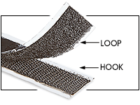
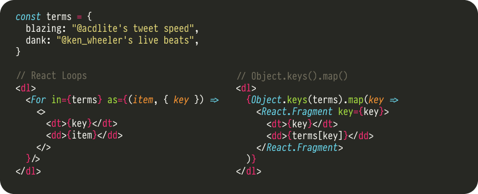

# React Loops — _React Velcro Architecture_

[](https://travis-ci.com/leebyron/react-loops)

React Loops work alongside React Hooks as part of the novel _React Velcro_
architecture for building sticky, secure user interfaces that don't come apart
under pressure.

## Get started with Velcro by installing React Loops!

Install with yarn or npm.

```sh
yarn add react-loops
```

And import into your Javascript.

```js
import { For } from 'react-loops'
```

React Loops comes ready with both Flow and TypeScript types for high quality
integration into codebases that use these tools.

## For-of Loops

Use the props `of` to provide the list and `as` to provide an element for
each item in the list. The `of` prop accepts Arrays, Array-likes,
and Iterables.

```js
import { For } from 'react-loops'

function Bulleted({ list }) {
  return (
    <ul>
      <For of={list} as={item =>
        <li>{item}</li>
      }/>
    </ul>
  )
}
```

Or provide a "render prop" function as a child.

```js
import { For } from 'react-loops'

function Bulleted({ list }) {
  return (
    <ul>
      <For of={list}>
        {item =>
          <li>{item}</li>
        }
      </For>
    </ul>
  )
}
```

## For-in Loops

Use the prop `in` to provide an Object instead of an Array or Iterable.

```js
import { For } from 'react-loops'

function BulletedDefinitions({ terms }) {
  return (
    <ul>
      <For in={terms} as={(item, {key}) =>
        <li>{key}: {item}</li>
      }/>
    </ul>
  )
}
```

## Loop iteration metadata

Access additional information about each iteration by destructuring the
second callback argument:

- `index`: A number from 0 to the length of the list
- `length`: The length of the list
- `key`: The key for this item in the list, same as `index` for Arrays
         but string Object properties for `in` loops
- `isFirst`: True for the first iteration
- `isLast`: True for the last iteration

```js
import { For } from 'react-loops'

function BulletedSentence({ list }) {
  return (
    <ul>
      <For of={list} as={(item, { isLast }) =>
        <li>{isLast && "and "}{item}</li>
      }/>
    </ul>
  )
}
```

## React Keys & Reorderable Collections

React Loops provides a `key` prop automatically on each child by default (by
using the `{ key }` loop iteration metadata). This is a great default if your
collection will not later reorder and an ergonomic improvement over your trained muscle memory of adding `key={i}` to every `list.map()` return value.

However, reorderable collections should still directly provide the `key` prop on
the element returned from the loop callback. Read more about [Lists and Keys](https://reactjs.org/docs/lists-and-keys.html) in the React documentation.

```js
import { For } from 'react-loops'

function BulletedReorderable({ list }) {
  return (
    <ul>
      <For of={list} as={item =>
        <li key={item.id}>{item.label}</li>
      }/>
    </ul>
  )
}
```


## What is _React Velcro_?

Only the newest, coolest, most blazing fast React architecture out there!

React Hooks has been an exciting development in the evolution of React, but it
felt like it was only half of the story. _React Loops_ completes the gripping
picture by providing React's missing control-flow operators via JSX elements.

The _React Velcro_ architecture was announced by [@leebyron](https://github.com/leebyron/) on [April 1st, 2019](https://twitter.com/leeb/status/1112867350389219328).

### Is this a Joke?

Take a look at this side by side with the old looping pattern and you tell me ([hint](https://media.giphy.com/media/l2SqbYoAwd3KK1wli/giphy.gif)).



### But isn't this a React anti-pattern? Just go use Angular or Vue?

Yes, React Loops is directly inspired by Angular and Vue. It's also directly
inspired by older XML component syntax like XSLT, JSTL, and E4X. These
technologies all have their drawbacks, however we should not abandon all aspects
of these ideas.

React Loops are not an anti-pattern. `array.forEach()` is not an anti-pattern
despite the existence of the `for..of` loop so neither should `<For>`. React
Loops follows React's model of components as encapsulation of behavior and
state. It uses the "render prop" pattern, like
[react-router](https://github.com/ReactTraining/react-router)'s  `<Route>` component, itself inspired by XSLT.

React considers Angular (and Vue) style directives anti-patterns not because
they emulate loops or control flow. It is because they affect _scope_ in ways
that removes the ability to use plain Javascript, require a template
language, and make using other tools like ESLint difficult. They also are
implemented as attributes (props) which can be used on any element which can
complicate type-checking and implementation.

React Loops avoids both of these drawbacks by providing `<For>` as a specific
component with a clear signature and uses callback functions to produce each
element in the collection for clear and "just Javascript" scoping rules which
avoid the need for template languages or other additional compilation steps.

Try React Loops in your project, you just might like it!

### Are there any other libraries supporting that _React Velcro_ architecture?

_*Yes*_

* [babel-plugin-jsx-control-statements](https://www.npmjs.com/package/babel-plugin-jsx-control-statements) is a Babel plugin with many control statements.
  > Its `<For>` component suffers from some of the problems described above, _caveat emptor_.
